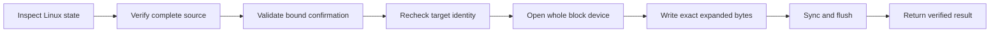

# Diskforge

Fail-closed whole-disk image deployment for Linux

[](https://github.com/ioplane/diskforge/actions/workflows/ci.yml)
[](https://github.com/ioplane/diskforge/releases/latest)
[](https://pkg.go.dev/github.com/ioplane/diskforge)
[](https://scorecard.dev/viewer/?uri=github.com/ioplane/diskforge)
[](https://go.dev/dl/)
[](LICENSE)

---

Diskforge verifies a raw or Zstandard-compressed disk image, evaluates the
current Linux host against an explicit safety policy, binds operator consent to
the observed target and image identities, and writes the verified bytes to a
whole block device. It is available as a reusable Go package and a JSON-first
CLI.

> [!CAUTION]
> A successful `diskforge write` irreversibly replaces data on the selected
> block device. Read the [safety model](docs/safety-model.md), inspect the JSON
> decision, and keep independent recovery media before using it.

## Why Diskforge

- **Fail closed:** missing or ambiguous Linux state rejects the operation.
- **Consent bound to evidence:** the confirmation token covers the canonical
  path, serial, WWN, capacity, image size, and complete SHA-256 digest.
- **Descriptor-held source:** the verified file descriptor, not a reopened
  pathname, supplies the bytes written to disk.
- **Bounded streaming:** raw and Zstandard sources have exact expanded-size
  enforcement; short and surplus streams fail.
- **Two explicit policies:** rescue mode requires an unused whole disk; live
  mode adds root-disk, tmpfs, memory, SysRq, read-only remount, and reboot gates.
- **Automation contract:** stable JSON, typed gate codes, distinct exit codes,
  and monotonic progress on stderr.
- **Container-only engineering:** formatting, analysis, tests, and builds run in
  the pinned OCI development image through Podman.

## Safety flow



The target is not opened writable until inspection, full source verification,
confirmation, and applicable live-mode preparation have succeeded. Immediately
after opening, Diskforge compares the descriptor device number and current
sysfs identity with the confirmed snapshot.

## Install

Download a Linux AMD64 archive from
[GitHub Releases](https://github.com/ioplane/diskforge/releases), verify its
checksum, and place `diskforge` on the executable path. Release artifacts are
static binaries. See [release verification](docs/release.md) for checksum,
signature, SBOM, and provenance verification.

## CLI

Every command writes its result as JSON to stdout. Progress and structured
errors go to stderr.

```console
diskforge inspect \
  --mode rescue \
  --target /dev/vdb \
  --image /run/diskforge/oracle-linux.raw.zst \
  --sha256 0123456789abcdef0123456789abcdef0123456789abcdef0123456789abcdef \
  --expected-bytes 34359738368
```

Review the returned target identity and copy its `confirmation_token` exactly:

```console
diskforge write \
  --mode rescue \
  --target /dev/vdb \
  --image /run/diskforge/oracle-linux.raw.zst \
  --sha256 0123456789abcdef0123456789abcdef0123456789abcdef0123456789abcdef \
  --expected-bytes 34359738368 \
  --confirmation 'confirm-v1-vdb-0123456789ab-0123456789abcdef'
```

Use `--dry-run` with `write` to repeat inspection and complete source
verification without opening the target. The full command and exit-code
contract is in the [CLI reference](docs/cli.md).

## Go API

```go
engine, err := diskforge.New()
if err != nil {
    return err
}

inspection, err := engine.Inspect(ctx, diskforge.InspectRequest{
    Mode:          diskforge.ModeRescue,
    TargetPath:    "/dev/vdb",
    ImagePath:     "/run/diskforge/oracle-linux.raw.zst",
    SHA256:        digest,
    ExpectedBytes: expandedBytes,
})
if err != nil {
    return err
}
```

The package exposes stable request, result, progress, and gate-error types.
Callers can use `errors.As` with `*diskforge.GateError` and must not parse human
messages. See the [API documentation](https://pkg.go.dev/github.com/ioplane/diskforge)
and [architecture](docs/architecture.md).

## Development

Development requires Podman and the Compose provider. Host Go installations are
not part of the supported workflow.

```console
/opt/podman/bin/podman build --pull=never \
  --tag localhost/ioplane/diskforge-dev:1.26.5 \
  --file Containerfile.dev .
/opt/podman/bin/podman compose run --rm test
/opt/podman/bin/podman compose run --rm lint
/opt/podman/bin/podman compose run --rm integration
```

The integration service is privileged but can write only to the temporary
loop-backed file it creates. Run services sequentially on memory-constrained
Podman machines. See [development](docs/development.md) for every verification
gate.

## Documentation

| Document | Purpose |
| --- | --- |
| [Architecture](docs/architecture.md) | Components, trust boundaries, and data flow |
| [Safety model](docs/safety-model.md) | Refusal rules and destructive guarantees |
| [CLI reference](docs/cli.md) | Commands, JSON streams, and exit codes |
| [Naming contract](docs/contracts/naming.md) | Mandatory public and artifact naming rules |
| [Development](docs/development.md) | Container-only contributor workflow |
| [Release](docs/release.md) | SemVer automation and artifact verification |
| [API validation](docs/architecture/0002-api-validation.md) | Upstream API and ownership evidence |

## Project status

Diskforge is pre-1.0. Safety refusals may become stricter in minor releases.
Public Go types, JSON fields, gate codes, and CLI exit codes follow Semantic
Versioning; incompatible changes are documented before release.

## Contributing and support

Read [CONTRIBUTING.md](CONTRIBUTING.md) before proposing changes. Security
reports follow [SECURITY.md](SECURITY.md); general help follows
[SUPPORT.md](SUPPORT.md). Community participation is governed by the
[Code of Conduct](CODE_OF_CONDUCT.md).

## License

Licensed under the [Apache License 2.0](LICENSE). See [NOTICE](NOTICE).
