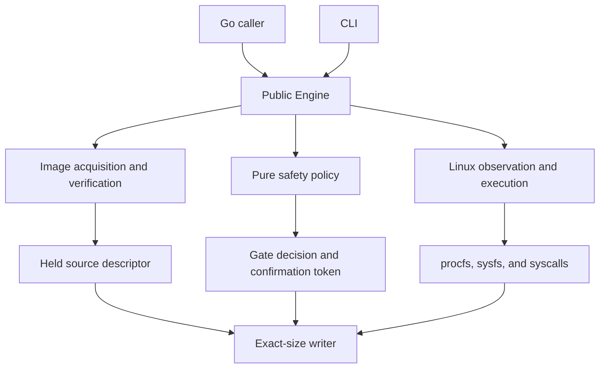
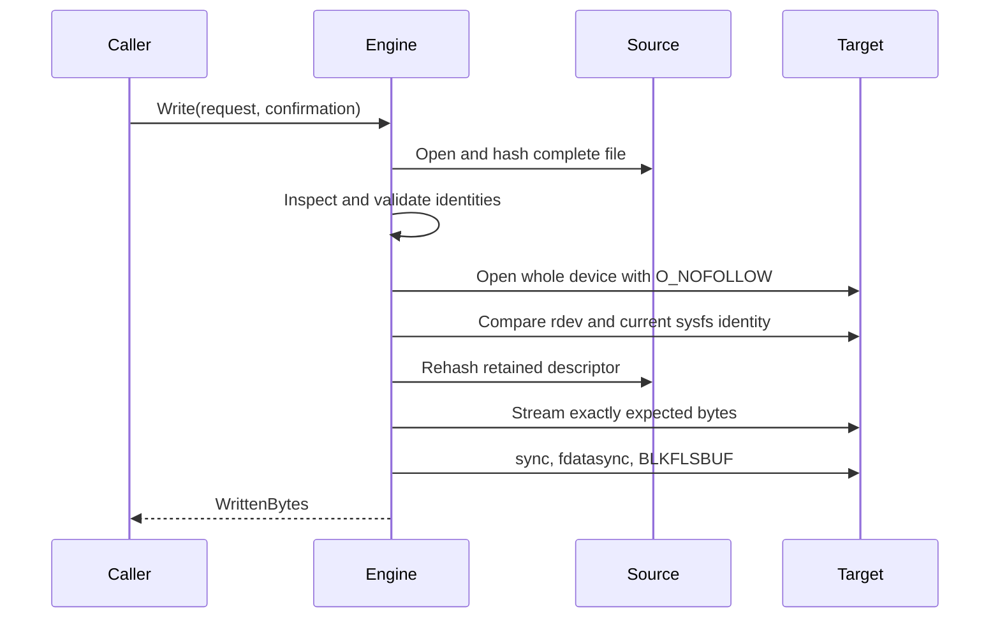

# Diskforge Architecture

## Component model

Diskforge separates acquisition, pure policy, Linux observation, destructive
execution, and operator presentation. Only the module-root package is public.

| Component | Responsibility | Must not do |
| --- | --- | --- |
| `diskforge` | Public requests, options, results, and error translation | Expose internal implementation types |
| `cmd/diskforge` | CLI parsing, JSON streams, and exit-code mapping | Reimplement policy or image logic |
| `internal/image` | Atomic staging, complete hashing, held descriptors, raw/zstd streaming | Select a target or infer operator consent |
| `internal/policy` | Deterministic decisions from immutable observations | Read files, devices, procfs, or sysfs |
| `internal/linux` | Observe Linux and execute the ordered privileged boundary | Repair ambiguous state or bypass policy |
| `internal/naming` | Validate release and public identifiers | Normalize invalid external input silently |

## Ownership model

`Engine` owns one reusable HTTP client and one Linux boundary. It starts no
background goroutines. A staged image owns a verified read-only descriptor
until `StagedImage.Close` is called. A write owns the target descriptor only for
the duration of the operation and closes it on every return path.

Contexts control staging, reverification, and streaming. Cancellation never
converts a partial write into success. Callers must assume a target contains an
incomplete image after any error that occurs after writing begins.

## Image path

Zstandard decoding uses a single worker, a 64 MiB maximum window, a 64 MiB
decoder-memory limit, and low-memory mode. Diskforge limits the stream to the
declared expanded size and then reads one additional byte to reject surplus
content.

## Public compatibility boundaries

Semantic Versioning applies to:

- exported Go identifiers and behavior;
- JSON field names and enum values;
- CLI commands, flags, stream selection, and exit codes;
- `GateCode` values;
- confirmation-token algorithm versions;
- release artifact names.

Human-readable messages, internal packages, tests, and undocumented
implementation details are not compatibility contracts. A safety rule may
become stricter without a major version when previously accepted state is
ambiguous or unsafe; the changelog must identify the change.

## Platform boundary

The implementation targets Linux. The initial published binary target is
Linux AMD64 because it has the complete static-build and privileged loop-device
evidence lane. Additional architectures require equivalent integration and
release verification before publication.
