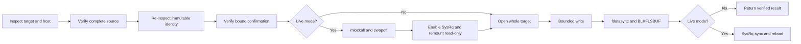
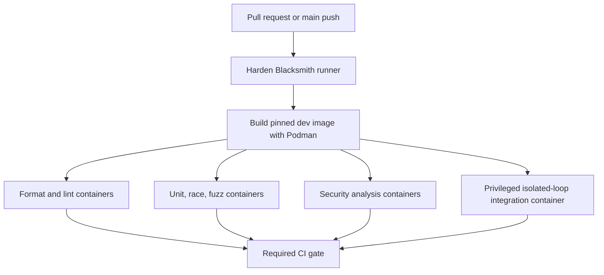

# Diskforge Repository and Release Contract

## 1. Decision

Diskforge is an independent public Go module and Linux command-line utility at
`github.com/ioplane/diskforge`. The repository starts with a clean public
history so that private image-build context and transitional module states are
not published.

The project exposes a reusable, typed Go API and a thin `diskforge` CLI. All
development, formatting, static analysis, testing, fuzzing, and release builds
run inside digest-pinned OCI containers through rootful Podman. Host-installed
Go tools are outside the supported development contract.

Release Please owns version selection, the release pull request,
`CHANGELOG.md`, the SemVer tag, and the initial GitHub Release. A tag-triggered
GoReleaser workflow appends verified artifacts to that release. GoReleaser does
not generate a second changelog.

## 2. Goals

- Preserve the proven fail-closed disk inspection and write behavior.
- Provide a stable Go API that can be imported without invoking a subprocess.
- Keep the CLI a direct projection of the public API and its typed errors.
- Support verified raw and Zstandard-compressed whole-disk images.
- Support rescue-mode writes and an explicitly gated live-root overwrite.
- Make destructive decisions machine-readable before any target is opened.
- Build a static Linux AMD64 release binary reproducibly.
- Enforce container-only development and CI on Blacksmith runners.
- Publish checksums, an SPDX SBOM, signatures, and build provenance.
- Maintain an English changelog automatically from Conventional Commits.
- Provide complete English governance, safety, development, and release docs.

## 3. Non-goals

- Partition-level installation or filesystem-aware copying.
- Image creation, cloud provisioning, or hypervisor orchestration.
- A daemon, remote control plane, web API, or graphical interface.
- Windows, macOS, or unvalidated architecture binaries.
- Runtime container images for privileged disk writing.
- Compatibility shims for unsafe command syntax.

## 4. Repository layout

```text
.
├── cmd/diskforge/                 CLI parsing, JSON output, and exit mapping
├── internal/image/                verification, staging, raw/zstd streaming
├── internal/linux/                procfs, sysfs, mounts, swap, and syscalls
├── internal/policy/               pure safety rules and confirmation tokens
├── docs/
│   ├── architecture/              architecture decision records
│   ├── contracts/                 naming and machine-readable contracts
│   ├── development.md             container-only contributor workflow
│   ├── release.md                 verification and release operations
│   └── safety-model.md            threat model and destructive guarantees
├── deployments/containers/        pinned development and release OCI images
├── integration_test.go            isolated loop-backed write acceptance
├── compose.yaml                   canonical Compose development interface
├── go.mod                         github.com/ioplane/diskforge
└── diskforge.go                   stable public facade and domain types
```

The module root is package `diskforge`. Consumers do not import packages under
`internal/`. Internal packages own private transport types and the root facade
performs explicit conversion to public types; dependency cycles and shared
utility packages are forbidden.

## 5. Public API

The stable facade consists of these concepts:

- `Engine`: immutable orchestrator constructed for Linux.
- `Mode`: closed enumeration containing `rescue` and `live`.
- `InspectRequest` and `Inspection`: target and host safety decision.
- `StageRequest` and `StagedImage`: bounded atomic acquisition.
- `WriteRequest` and `WriteResult`: verified destructive operation.
- `TargetIdentity` and `ImageIdentity`: immutable confirmation inputs.
- `GateCode` and `GateError`: stable machine-readable refusal contract.
- `Progress`: monotonic byte progress reported through an optional callback.

The primary signatures are:

```go
func New(options ...Option) (*Engine, error)
func (engine *Engine) Inspect(
    context.Context, InspectRequest,
) (Inspection, error)
func (engine *Engine) Stage(
    context.Context, StageRequest,
) (*StagedImage, error)
func (engine *Engine) Write(
    context.Context, WriteRequest,
) (WriteResult, error)
func ConfirmationToken(TargetIdentity, ImageIdentity) (string, error)
```

Long-running and I/O APIs accept `context.Context` as their first parameter.
Requests are value objects. Paths are canonicalized before policy evaluation.
Errors wrap causes with `%w`, support `errors.Is` and `errors.As`, and never
encode required machine behavior only in human-readable strings.

The source image is opened once during verification. The verified descriptor,
not the pathname, is used for the write. Ownership and close behavior are
explicit in the API. Zstandard decoding uses one worker, a 64 MiB maximum
window, a 64 MiB decoder-memory ceiling, checksum verification, and an explicit
decoder close.

The CLI subcommands are `inspect`, `stage`, `write`, and `version`. JSON is the
stable automation format. Human progress is bounded and goes to stderr. Result
JSON goes to stdout. Usage failures, gate refusals, and operational failures
have distinct documented exit codes.

## 6. Destructive safety model

The mandatory order is:



The target is never opened for write before every applicable gate passes.
Rescue mode rejects mounted, swap-backed, root-related, partition, undersized,
source-related, or device-mapper-dependent targets. Live mode additionally
requires the physical root disk, a tmpfs source, sufficient available memory,
available SysRq, explicit immediate reboot, successful read-only remount, and
post-remount verification of block-backed superblocks.

The confirmation token binds the canonical target path, serial, WWN, target
capacity, expanded image size, and full source SHA-256. Any changed field
invalidates the token. Dry-run performs full inspection and source verification
but never requests confirmation or opens the target.

## 7. Container-only engineering contract

The development image uses
`docker.io/library/golang:1.26.5-trixie@sha256:87ffdb09b6a2e29ff910748b745395e8a0299aa80b7c0551cdca9b55e3fd2b3e`
for Linux AMD64. The tag and digest change together after upstream verification.

The initial verified toolchain is:

| Tool | Version |
| --- | --- |
| Go | 1.26.5 |
| golangci-lint | 2.12.2 |
| GoReleaser | 2.17.1 |
| gopls | 0.23.0 |
| govulncheck module | 1.6.0 |
| gofumpt | 0.11.0 |
| Staticcheck | 2026.1 |
| gosec | 2.28.0 |

Every dependency and action is checked against its official release page, the
Go module proxy, or the developer site before it is pinned. Dependabot watches
Go modules, container bases, and GitHub Actions. Floating `latest` versions and
unpinned third-party Actions are forbidden.

`compose.yaml` defines one-shot services for format checking, linting, gopls
diagnostics, unit tests, race tests, fuzz smoke tests, vulnerability analysis,
release snapshot validation, documentation linting, and integration tests.
The file uses the current Compose Specification and has no obsolete top-level
`version` field. Project scripts, Makefiles, and host Go commands are not part
of the interface.

## 8. Static analysis and testing

golangci-lint v2 uses `default: all` with documented exclusions for conflicting,
deprecated, or inapplicable rules. It enables security, correctness, error,
context, resource-lifetime, complexity, performance, documentation, formatting,
and test linters. Issue caps are zero; `nolint` directives require a specific
linter and an explanation. Exclusions are narrow, path-scoped, and documented.

Independent gates include:

- gofmt, gofumpt, goimports, and `go mod tidy` drift;
- `go vet`, Staticcheck, gosec, govulncheck, and gopls diagnostics;
- golangci-lint v2 with all configured linters;
- unit tests with shuffle, race detector, atomic coverage, and no cache;
- a minimum 85 percent statement coverage threshold;
- fuzz smoke tests for identity, procfs/sysfs parsers, staging, and decoders;
- dead-code and dependency-boundary checks;
- loop-backed rescue integration with complete byte comparison;
- Markdown, YAML, spelling, actionlint, and workflow-security checks;
- secret scanning, dependency review, filesystem/SBOM scanning, and Scorecard.

Tests must prove every refusal code, exact destructive ordering, cancellation,
short and surplus streams, corrupt Zstandard input, source path replacement,
partial download cleanup, flush failures, and live-only gate behavior. No test
may perform a destructive write against an unresolved or host-provided device.

## 9. CI architecture

All jobs use Blacksmith Ubuntu 24.04 runners. Checkout and runner hardening are
orchestration steps; every Go build, format, lint, analysis, fuzz, and test
command runs in a Podman container built from
`deployments/containers/development.Containerfile`.



Actions are pinned to immutable commit SHAs with a version comment. Workflow
permissions default to none and are granted per job. Concurrency cancels stale
PR runs but never cancels releases. Untrusted pull requests never receive
write-capable tokens.

## 10. Changelog and release automation

Release Please `17.11.1` with release-please-action `5.0.0` runs on pushes to
`main`. It maintains a release pull request from Conventional Commits. That PR
updates `CHANGELOG.md` and `.release-please-manifest.json`. Merging it creates a
`vMAJOR.MINOR.PATCH` tag and the corresponding GitHub Release.

The action uses a repository-scoped `RELEASE_PLEASE_TOKEN` with only the access
needed to maintain the release pull request and publish the release. A token
distinct from the ephemeral `GITHUB_TOKEN` is required so the published release
emits the downstream workflow event.

The release workflow listens once for the published GitHub Release, verifies
that its tag is stable SemVer and points to `main`, rebuilds all gates inside
Podman, then runs GoReleaser inside the pinned release container. GoReleaser
uses release mode `append`, disables its own changelog generation, and attaches
artifacts to the Release created by Release Please.

The first public release is `v0.1.0`. Before 1.0, breaking changes bump the
minor version and features bump the minor version. A stable `v1.0.0` requires a
separate compatibility review of the exported Go API, CLI JSON schema, exit
codes, gate codes, and artifact names.

Release assets are:

- `diskforge_<version>_linux_amd64.tar.gz`;
- `diskforge_<version>_checksums.txt`;
- SPDX JSON SBOM documents;
- a keyless Cosign v3 Sigstore bundle for the checksum file;
- GitHub build provenance attestation;
- a source archive produced by GoReleaser.

Only Linux AMD64 is released until another architecture has equivalent
destructive integration evidence. The binary is stripped, statically linked,
and reports version, commit, and build date through `diskforge version --json`.

## 11. Naming contract

The normative naming rules live in `docs/contracts/naming.md` and are enforced
by tests and linters.

- Repository, module component, binary, command, OCI, workflow, and Compose
  names use lowercase ASCII and hyphens where separators are allowed.
- DNS-like repository and OCI labels follow RFC 1123 label constraints.
- Download paths and artifact tokens use the RFC 3986 unreserved character
  set; artifact templates additionally allow the extension delimiter `.`.
- Go package names are short lowercase words without underscores or hyphens.
- Exported Go identifiers follow Go initialism and receiver conventions.
- Release tags are `vMAJOR.MINOR.PATCH`; versions inside filenames omit `v`.
- Machine timestamps use UTC RFC 3339; dates in human documents use
  `YYYY-MM-DD`.
- Files contain no spaces, locale-dependent characters, unexplained
  abbreviations, mutable labels such as `final`, or ambiguous numeric dates.
- Ordered tokens progress from project to version to platform to architecture
  to extension.

These rules incorporate the Harvard file-naming recommendations for meaningful
names, consistent ordering, machine readability, documented abbreviations, and
version control. They also apply the supplied operational naming guidance for
consistency, scope, and maintainability.

## 12. Repository governance and documentation

All prose is English. Required root documents are `README.md`, `LICENSE`,
`NOTICE`, `CHANGELOG.md`, `CONTRIBUTING.md`, `CODE_OF_CONDUCT.md`, `SECURITY.md`,
`SUPPORT.md`, `GOVERNANCE.md`, and `MAINTAINERS.md`.

GitHub metadata includes CODEOWNERS, issue forms, a pull-request template,
Dependabot configuration, repository settings documentation, release-note
labels, and workflows for CI, release management, release publication,
security, Scorecard, and stale issue handling.

README badges cover CI, release, Go reference, Scorecard, Go version, and
Apache-2.0. README and architecture documentation include
Mermaid diagrams for safety flow, component boundaries, and the release path.

Only product source, tests, governance, documentation, and reproducible build
material are versioned. Generated Go, SBOM, coverage, and release outputs are
either reproducible tracked contracts or ignored build artifacts.

## 13. Acceptance criteria

The repository is complete when:

1. The clean module imports as `github.com/ioplane/diskforge` and exposes the
   documented facade.
2. The CLI is behaviorally compatible with the previously accepted inspect,
   stage, dry-run, rescue-write, and live-write contracts.
3. Every development, build, test, and release command is proven to execute
   inside Podman rather than through host Go tooling.
4. All static analysis, unit, race, fuzz, documentation, security, and
   isolated-loop integration gates pass without warnings.
5. GoReleaser snapshot output is static, correctly named, checksummed, and
   accompanied by an SPDX SBOM.
6. Release Please produces the expected release PR and changelog in dry-run or
   manifest validation.
7. A public `ioplane/diskforge` repository exists with topics, description,
   Apache-2.0 license, branch rules, required checks, and security settings.
8. Tag `v0.1.0` automatically publishes a verified GitHub Release through the
   Blacksmith and Podman release workflow.
9. The image-building consumer uses the released diskforge artifact or Go
   module and no longer owns a divergent implementation.

## 14. References

- [Semantic Versioning 2.0.0](https://semver.org/)
- [Conventional Commits 1.0.0](https://www.conventionalcommits.org/en/v1.0.0/)
- [Keep a Changelog 1.1.0](https://keepachangelog.com/en/1.1.0/)
- [Compose Specification](https://github.com/compose-spec/compose-spec/blob/main/spec.md)
- [Containers configuration documentation](https://github.com/containers/common/tree/main/docs)
- [Release Please](https://github.com/googleapis/release-please)
- [GoReleaser](https://github.com/goreleaser/goreleaser)
- [RFC 1123](https://www.rfc-editor.org/rfc/rfc1123)
- [RFC 3986](https://www.rfc-editor.org/rfc/rfc3986)
- [RFC 3339](https://www.rfc-editor.org/rfc/rfc3339)
- [Harvard file-naming conventions](https://datamanagement.hms.harvard.edu/plan-design/file-naming-conventions)
- [IT Glue naming conventions](https://www.itglue.com/blog/naming-conventions-examples-formats-best-practices/)
