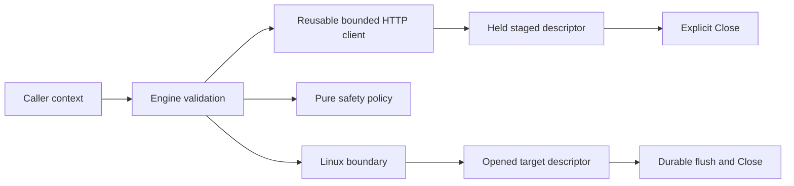

# API and Ownership Validation

## Decision

Diskforge validates every standard-library, compression, and Linux syscall
boundary against the pinned toolchain before exposing it through `Engine`.
The public API owns no implicit background work. A returned `StagedImage` owns
one verified descriptor and callers close it explicitly. `Engine` reuses one
bounded HTTP client and translates internal policy refusals into stable public
`GateError` values.



## Validated sources

| Boundary | Version or ID | Validated contract |
| --- | --- | --- |
| Go toolchain | Go 1.26.5; Context7 `/golang/go/go1.26.0` | Context lifetime, reusable `http.Client`, `%w`, `errors.Is`, `errors.As`, and explicit file ownership |
| Zstandard | `github.com/klauspost/compress v1.19.1`; Context7 `/klauspost/compress` | Streaming reader, one-worker decode, bounded memory and window, checksum enforcement, and explicit decoder close |
| Linux syscalls | `golang.org/x/sys v0.47.0`; Context7 `/golang/sys` | Memory locking, resource limits, descriptor open and stat, durable flush, block-buffer ioctl, and the swapoff syscall exception |
| Go language server | `golang.org/x/tools/gopls v0.23.0` | Whole-module type and API diagnostics with `gopls check` |

The Context7 source selection used exact project-name matches with high source
reputation. Patch-level Go 1.26.5 uses the Go 1.26 API record. Dependency
versions remain pinned in `go.mod` and the development image.

## Go context and HTTP ownership

Go documents that `http.Client` values should be reused and are safe for
concurrent use. Diskforge therefore constructs one client per `Engine`.
`WithHTTPClient` copies the client configuration while retaining its reusable,
concurrency-safe transport and rejects a nil client or a nonpositive total
timeout.

Outgoing request contexts control connection acquisition, request transfer,
response headers, and response-body reads. Diskforge checks cancellation before
validation or I/O and passes the same context to the HTTP request and image
stream. A nil context is rejected as `ErrInvalidRequest` instead of allowing a
standard-library panic.

Relevant upstream sources:

- [`net/http.Client`](https://github.com/golang/go/blob/go1.26.0/src/net/http/client.go)
- [`http.Request` context ownership](https://github.com/golang/go/blob/go1.26.0/src/net/http/request.go)
- [`fmt.Errorf` wrapping](https://github.com/golang/go/blob/go1.26.0/src/fmt/errors.go)

## Zstandard streaming

The selected APIs are:

```go
func zstd.NewReader(r io.Reader, opts ...zstd.DOption) (*zstd.Decoder, error)
func zstd.WithDecoderConcurrency(n int) zstd.DOption
func zstd.WithDecoderMaxMemory(n uint64) zstd.DOption
func zstd.WithDecoderMaxWindow(size uint64) zstd.DOption
func zstd.WithDecoderLowmem(enabled bool) zstd.DOption
func (*zstd.Decoder).Close()
```

Diskforge uses concurrency `1`, a 64 MiB maximum memory allowance, a 64 MiB
maximum window, and low-memory mode. It never selects `IgnoreChecksum`, so frame
checksums remain enforced. The decoder is closed on every return path. The
streaming limit prevents any byte beyond the declared expanded size from
reaching the target.

Relevant upstream source:

- [`zstd` streaming documentation](https://github.com/klauspost/compress/blob/v1.19.1/zstd/README.md)

## Linux syscall boundary

Pinned `go doc` inspection inside the development container validated these
signatures:

```go
func unix.Mlockall(flags int) error
func unix.Getrlimit(resource int, limit *unix.Rlimit) error
func unix.Setrlimit(resource int, limit *unix.Rlimit) error
func unix.Open(path string, mode int, perm uint32) (int, error)
func unix.Fstat(fd int, stat *unix.Stat_t) error
func unix.Fdatasync(fd int) error
func unix.IoctlSetInt(fd int, request uint, value int) error
```

`unix.BLKFLSBUF` is available for the block-buffer flush request.
`x/sys v0.47.0` does not expose a typed `Swapoff` wrapper. The only direct
syscall is therefore isolated in one private function using
`unix.BytePtrFromString`, `unix.SYS_SWAPOFF`, and `runtime.KeepAlive`. Gosec
G103 is suppressed only on that audited call site with this reason.

The opened target uses `O_WRONLY | O_CLOEXEC | O_NOFOLLOW`, plus `O_EXCL` in
rescue mode. Before writing, Diskforge compares the opened descriptor's block
type and major/minor number with the confirmed sysfs identity, and compares the
current path, serial, WWN, capacity, kernel name, partition flag, and related
devices with the immutable inspection snapshot.

Relevant upstream source:

- [`golang.org/x/sys/unix`](https://github.com/golang/sys/tree/v0.47.0/unix)

## Error and descriptor contract

`GateError` implements `Error`, `Is`, and `Unwrap`. Internal policy errors are
converted to the corresponding public `GateCode`; operational causes remain in
the error chain. Malformed digests and image-size mismatches are also mapped to
stable gate codes.

`StagedImage.Close` is idempotent because the internal verified descriptor
serializes close and clears its file pointer. Dry runs close the verified source
before returning. Destructive writes close both the verified source and target
descriptor on every return path.

## Verification evidence

The canonical checks run inside the pinned OCI image through Podman Desktop:

```console
/opt/podman/bin/podman compose run --rm test
/opt/podman/bin/podman compose run --rm race
/opt/podman/bin/podman compose run --rm lint
/opt/podman/bin/podman compose run --rm gopls
/opt/podman/bin/podman compose run --rm test gosec -quiet ./...
/opt/podman/bin/podman compose run --rm test deadcode -test ./...
```

The accepted API revision produced no gopls diagnostics, no dead code, and zero
golangci-lint issues.
