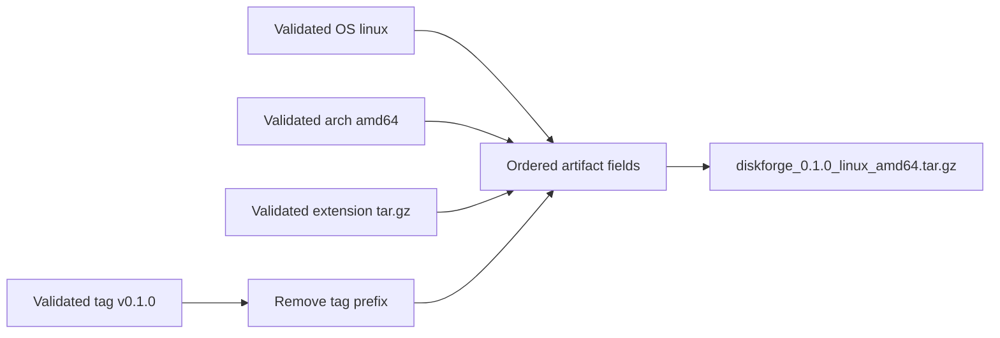
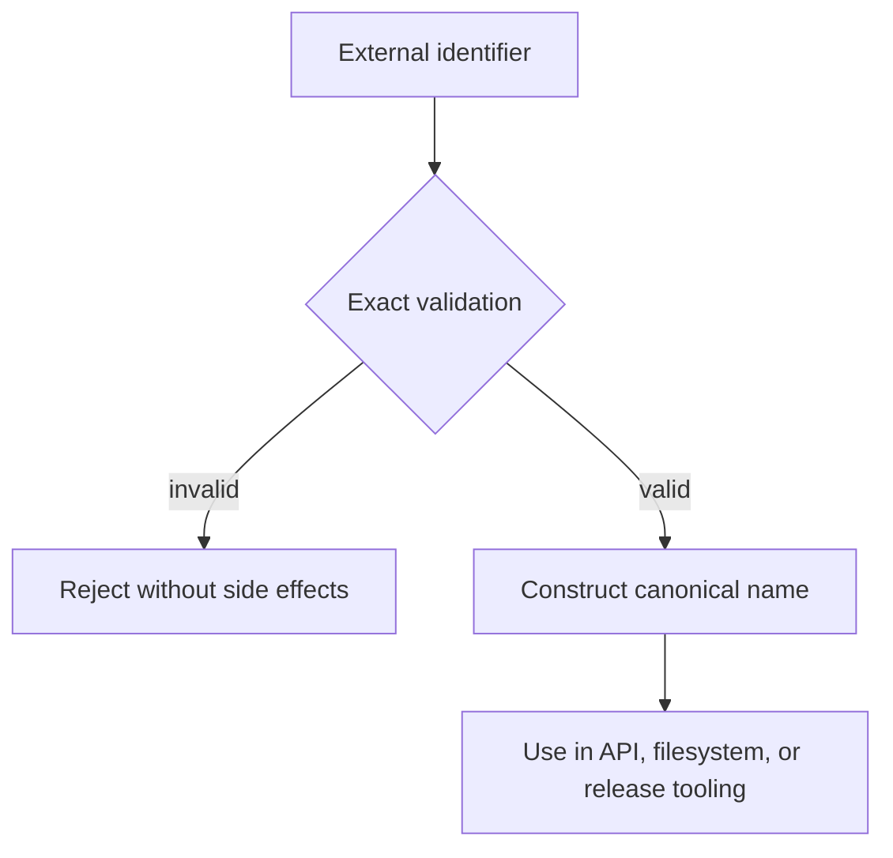

# Naming Contract

## 1. Purpose

This contract defines stable, portable names for the Diskforge repository,
Go API, CLI, machine-readable output, OCI development environment, and release
artifacts. It is normative for source, automation, documentation, and public
interfaces.

The key words **MUST**, **MUST NOT**, **SHOULD**, and **SHOULD NOT** are to be
interpreted as described by
[BCP 14](https://www.rfc-editor.org/info/bcp14) when they appear in uppercase.

## 2. General rules

Names MUST be meaningful, consistent, machine-readable, and stable across
operating systems and locales.

- Public names MUST use ASCII.
- Names MUST NOT contain spaces, control characters, path separators, or shell
  metacharacters.
- Lowercase is required unless a language convention explicitly requires
  another form, such as an exported Go identifier.
- Hyphens separate words in DNS-like and human-facing identifiers.
- Underscores separate ordered fields in release artifact names.
- Periods separate version components and filename extensions.
- Names MUST NOT use mutable qualifiers such as `latest`, `new`, `old`,
  `final`, or `current` as identity.
- Abbreviations MUST be documented and used consistently.
- Dates MUST NOT use ambiguous numeric formats.
- User-controlled input MUST be validated before it is interpolated into a
  filename, URL, command argument, or JSON object.

## 3. Name classes

<!-- markdownlint-disable MD013 -->

| Name class | Required form | Example |
| --- | --- | --- |
| GitHub organization | Lowercase RFC 1123 label | `ioplane` |
| Repository | Lowercase RFC 1123 label | `diskforge` |
| Go module | Canonical repository URL | `github.com/ioplane/diskforge` |
| Go package | Short lowercase word | `naming` |
| Binary | Lowercase RFC 1123 label | `diskforge` |
| CLI subcommand | Lowercase word or hyphenated words | `rescue-write` |
| Long CLI flag | Lowercase hyphenated words | `--confirmation-token` |
| JSON field | Lowercase snake case | `target_path` |
| Environment variable | Uppercase snake case with project prefix | `DISKFORGE_LOG_LEVEL` |
| OCI repository | Lowercase slash-separated labels | `ghcr.io/ioplane/diskforge-dev` |
| Compose project and service | Lowercase RFC 1123 label | `diskforge`, `integration` |
| GitHub workflow file | Lowercase hyphenated filename | `release-please.yaml` |
| GitHub job identifier | Lowercase snake case | `integration_test` |
| Release tag | Stable SemVer with `v` prefix | `v0.1.0` |
| Release archive | Ordered underscore-separated fields | `diskforge_0.1.0_linux_amd64.tar.gz` |
| Machine timestamp | UTC RFC 3339 | `2026-08-06T02:30:00Z` |
| Document date | ISO 8601 calendar date | `2026-08-06` |

<!-- markdownlint-enable MD013 -->

An RFC 1123 label in this contract is 1 to 63 lowercase ASCII letters,
digits, or hyphens. It MUST start and end with a letter or digit. Numeric-only
architecture labels such as `386` are valid.

## 4. Go naming

The module path MUST be `github.com/ioplane/diskforge`.

- Package names MUST be short lowercase words without hyphens or underscores.
- Exported identifiers MUST use Go mixed caps and include documentation.
- Initialisms SHOULD use consistent capitalization, for example `URL`, `ID`,
  `JSON`, `HTTP`, and `SHA256`.
- Receiver names SHOULD be one or two lowercase letters derived from the type.
- Getters MUST omit a redundant `Get` prefix unless the operation performs
  work beyond returning a property.
- Context-aware operations MUST accept `context.Context` as their first
  parameter.
- Test names MUST describe observable behavior and use Go mixed caps after the
  `Test`, `Benchmark`, or `Fuzz` prefix.

## 5. CLI and JSON naming

The executable name is `diskforge`. Subcommands and long flags MUST be
lowercase, use hyphens between words, and remain stable after publication.

JSON object fields MUST use lowercase snake case. Enum values and stable error
codes MUST use lowercase snake case. Human messages are not identifiers and
MUST NOT be parsed by callers.

Examples:

```json
{
  "gate_code": "target_is_mounted",
  "target_path": "/dev/vda",
  "verified_at": "2026-08-06T02:30:00Z"
}
```

## 6. Release versions and tags

Diskforge follows [Semantic Versioning 2.0.0](https://semver.org/). Git tags
for automated public releases use this deliberately restricted grammar:

```abnf
stable-tag = "v" numeric-identifier "." numeric-identifier "." numeric-identifier
numeric-identifier = "0" / non-zero-digit *DIGIT
non-zero-digit = %x31-39
```

The release workflow accepts stable `vMAJOR.MINOR.PATCH` tags only. Leading
zeros, prerelease identifiers, build metadata, whitespace, and a missing or
uppercase `v` prefix are invalid. The first public release tag is `v0.1.0`.

This restriction controls automated publication; it does not redefine which
version strings are valid under the full SemVer specification.

## 7. Release artifact names

Release archive names MUST use this ordered grammar:

```text
diskforge_<version>_<operating-system>_<architecture>.<extension>
```

- `<version>` is the validated release tag without its leading `v`.
- `<operating-system>` and `<architecture>` are lowercase RFC 1123 labels.
- `<extension>` contains lowercase letters, digits, hyphens, and periods.
  A separator MUST occur only between non-empty alphanumeric segments.
- The complete filename MUST NOT exceed 255 bytes.
- Each platform or extension label MUST NOT exceed 63 bytes.

The initial release archive is:

```text
diskforge_0.1.0_linux_amd64.tar.gz
```

Checksums, signatures, certificates, provenance, and SBOM documents MUST use
the same project and version vocabulary. GoReleaser configuration and tests
MUST enforce the names before a release is published.



## 8. Confirmation tokens

A confirmation token is an opaque, versioned safety identifier produced by
Diskforge. Callers MUST use it exactly as returned and MUST NOT derive meaning
from its contents.

- The token MUST contain lowercase ASCII from the RFC 3986 unreserved set.
- The format MUST begin with a stable version prefix so future algorithms can
  coexist without ambiguity.
- The digest portion MUST use lowercase hexadecimal.
- The token MUST NOT contain a path separator, whitespace, or user-supplied
  display text.
- Logs and JSON MAY include a token, but filenames MUST NOT be derived from it.

The current format begins with `confirm-v1-`, followed by a validated device
label, a short image-digest fragment, and a bound identity-digest fragment.
For example:

```text
confirm-v1-vda-0123456789ab-ca99718141349949
```

The safety contract, including every target and image identity field bound to
the digest, is defined by the public API and policy tests.

## 9. Time and date names

Machine-readable timestamps MUST use UTC RFC 3339 with the `Z` suffix. Human
documents MUST use `YYYY-MM-DD`. Filenames SHOULD omit timestamps when a
SemVer version or content digest already provides a stable identity.

When a timestamp is necessary in a filename, it MUST use
`YYYYMMDDTHHMMSSZ`, for example `20260806T023000Z`.

## 10. Validation boundary

Validation MUST occur before filesystem, network publication, archive, or
process execution operations. Invalid input MUST return an error and MUST NOT
be normalized silently. In particular, implementations MUST NOT lowercase,
trim, path-clean, or otherwise repair invalid external input.



## 11. References

- [RFC 1123: Requirements for Internet Hosts](https://www.rfc-editor.org/rfc/rfc1123)
- [RFC 3339: Date and Time on the Internet](https://www.rfc-editor.org/rfc/rfc3339)
- [RFC 3986: Uniform Resource Identifier Syntax](https://www.rfc-editor.org/rfc/rfc3986)
- [Semantic Versioning 2.0.0](https://semver.org/)
- [Harvard Biomedical Data Management file-naming conventions](https://datamanagement.hms.harvard.edu/plan-design/file-naming-conventions)
- [IT Glue naming conventions and best practices](https://www.itglue.com/blog/naming-conventions-examples-formats-best-practices/)
- [Effective Go: Names](https://go.dev/doc/effective_go#names)
