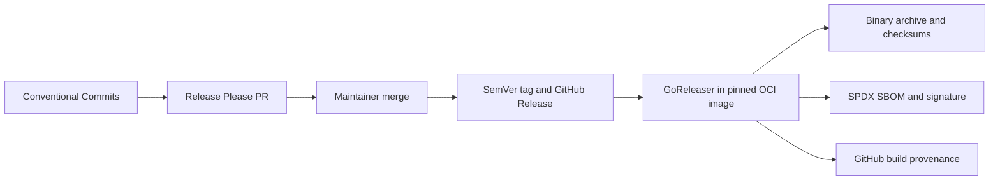

# Diskforge Release and Verification

## Release ownership

Release Please reads Conventional Commits on `main`, maintains the release pull
request and [CHANGELOG.md](../CHANGELOG.md), selects the Semantic Version, and
creates the `vMAJOR.MINOR.PATCH` tag and GitHub Release. GoReleaser builds and
attaches artifacts; its own changelog generation is disabled.



The initial artifact target is `linux/amd64`. The archive name follows the
mandatory naming contract:

```text
diskforge_<version>_linux_amd64.tar.gz
```

## Maintainer release process

1. Merge only Conventional Commits with green required checks.
2. Review the Release Please pull request, changelog categories, and proposed
   SemVer change.
3. Merge the release pull request without manually creating a tag.
4. Confirm the release workflow reruns verification and GoReleaser validation.
5. Confirm the archive, checksum file, SPDX SBOM, signature, certificate, and
   build provenance are attached to the release.
6. Download and verify the release as a consumer before announcing it.

Tags are immutable. A failed release is repaired with a new patch version; an
existing tag or asset is not replaced silently.

## Local release snapshot

The pinned release container writes local GoReleaser output only below the
ignored `.artifacts/release` tree:

```console
/opt/podman/bin/podman compose run --rm release-check
/opt/podman/bin/podman compose run --rm release-snapshot
```

The snapshot must contain the Linux AMD64 archive, source archive, checksum
file, and two SPDX 2.3 documents. Local artifacts are verification evidence;
they are never committed.

## Consumer verification

Set the expected release version and download the archive plus checksum:

```console
VERSION=0.1.0
BASE="https://github.com/ioplane/diskforge/releases/download/v${VERSION}"
curl -fsSLO "${BASE}/diskforge_${VERSION}_linux_amd64.tar.gz"
curl -fsSLO "${BASE}/diskforge_${VERSION}_checksums.txt"
sha256sum --check --ignore-missing "diskforge_${VERSION}_checksums.txt"
```

Verify GitHub build provenance:

```console
gh attestation verify "diskforge_${VERSION}_linux_amd64.tar.gz" \
  --repo ioplane/diskforge
```

Download the Cosign v3 bundle and verify the keyless signature over the
checksum file with the workflow identity published by the release:

```console
curl -fsSLO "${BASE}/diskforge_${VERSION}_checksums.txt.sigstore.json"
cosign verify-blob \
  --bundle "diskforge_${VERSION}_checksums.txt.sigstore.json" \
  --certificate-identity-regexp \
  '^https://github\.com/ioplane/diskforge/.github/workflows/release.yml@refs/tags/v' \
  --certificate-oidc-issuer https://token.actions.githubusercontent.com \
  "diskforge_${VERSION}_checksums.txt"
```

Finally, extract the archive and confirm its self-reported identity:

```console
tar -xzf "diskforge_${VERSION}_linux_amd64.tar.gz"
./diskforge version --json
```

The reported version, commit, platform, and build date MUST match the release
and attested source commit before the binary is granted root privileges.
