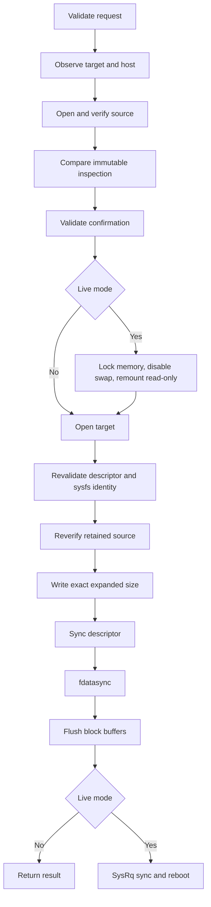

# Diskforge Safety Model

## Objective

Diskforge MUST reject a write unless it can prove that the selected whole block
device, verified image, current Linux state, and operator confirmation satisfy
one documented policy. Absence, ambiguity, parse failure, or identity drift is
a refusal, not a warning.

Diskforge does not prove that an image is trustworthy, bootable, compatible
with the destination system, or recoverable. Operators remain responsible for
source provenance, backups, access control, and recovery media.

## Immutable decision inputs

The confirmation token binds:

- canonical `/dev/<name>` target path;
- kernel device name;
- serial and WWN when exposed by sysfs;
- target byte capacity and partition status;
- target descendants and backing relations;
- source path, complete SHA-256, compressed bytes, and expanded bytes;
- policy mode.

The complete token is compared in constant time. Diskforge re-observes the
target after opening it and rejects any changed path identity, major/minor
device number, serial, WWN, capacity, partition flag, or relation set.

## Rescue mode

Rescue mode requires root privileges and a whole target large enough for the
expanded image. The target and every related descendant MUST be absent from
the mounted-device and active-swap sets. The source filesystem MUST NOT be
backed by the target or a related device.

The target is opened with `O_WRONLY`, `O_CLOEXEC`, `O_NOFOLLOW`, and `O_EXCL`.
This rejects symlink traversal and asks the kernel for exclusive block-device
access.

## Live mode

Live mode exists for replacing the running root disk from memory. It is more
dangerous and adds all of these gates:

- target resolves to the physical root disk;
- source resides on tmpfs;
- available memory is at least 512 MiB before memory locking;
- SysRq controls are present and writable;
- the caller explicitly approves immediate reboot;
- `mlockall` succeeds;
- every active swap area is disabled;
- SysRq is enabled;
- the SysRq read-only remount completes and every block-backed mount is proven
  read-only;
- after a successful write, SysRq sync and immediate reboot both succeed.

Live mode is terminal by design. Applications MUST NOT expect the calling
process to continue after a successful live write.

## Source verification

The source MUST be a regular file with an exact lowercase SHA-256 digest.
Diskforge opens it once, hashes the complete descriptor, retains that descriptor
through inspection and confirmation, verifies size and content again before
writing, and then streams from the same descriptor.

Atomic staging downloads to a temporary file in the destination directory,
enforces a caller-supplied compressed-byte ceiling, synchronizes the file,
verifies the complete digest, renames it atomically, and synchronizes the
directory. Failed or canceled staging removes the temporary file.

## Destructive order

No error after the target opens can restore overwritten data. Errors report
failure and retain their cause; they never report a partially written target as
success.

## Integration boundary

The privileged integration test allocates a free loop-device number through
`/dev/loop-control`, creates a device node for that number, attaches a bounded
temporary regular file, exercises the public API, compares the complete written
prefix and untouched suffix, detaches the device, and removes its node. The test
does not accept a target path from the environment or command line.
